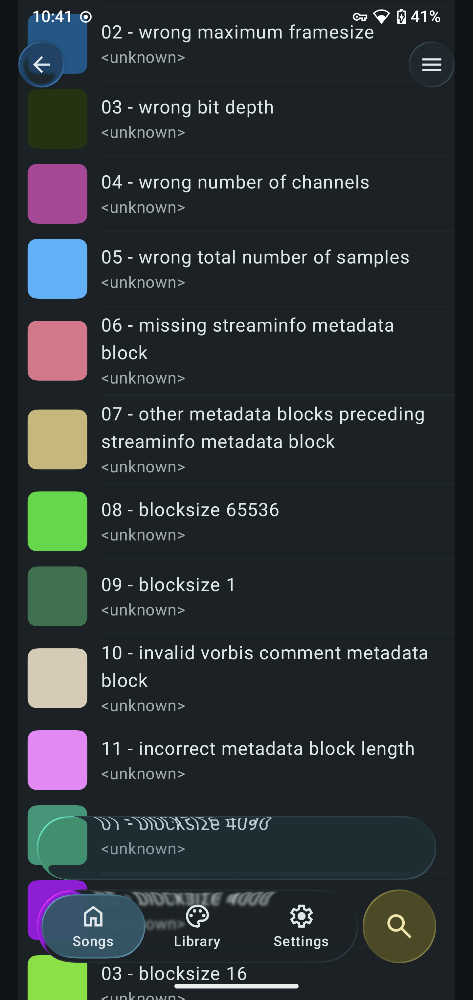

# Liquid Glass

Apple's Liquid Glass effect for Android Jetpack Compose.

## Demos

- [Playground app](./app/release/app-release.apk), Android 13 and above is required.


- [Music player demo](./glassmusic/release/glassmusic-release.apk)



## Library

⚠️ The library is in alpha stage, every API may be changed, use it on your own risk.

### Add to project

[](https://jitpack.io/#Kyant0/AndroidLiquidGlass)

```kotlin
// settings.gradle.kts in root project
dependencyResolutionManagement {
    repositories {
        maven("https://jitpack.io")
    }
}

// build.gradle.kts in module
implementation("com.github.Kyant0:AndroidLiquidGlass:<version>")
```

### Examples

### After 1.0.0-alpha09

We use the new `Backdrop` API introduced in 1.0.0-alpha09 to implement the glass effect.
You can do more with the new API, not only the glass effect, but also the blur effect, magnifier, etc.

#### Basic example

```kotlin
val backdrop = rememberLayerBackdrop(backgroundColor = Color.White)

Box {
    // backdrop content used to fill the backdrop layer
    Box(Modifier.backdrop(backdrop))

    // icon button with glass effect
    Box(
        Modifier
            // [optional] drop shadow effect
            .backdropShadow(CircleShape)
            // draw the backdrop with glass effect
            .drawBackdrop(backdrop) {
                // set the shape
                shape = CircleShape

                // apply visual effects
                if (Build.VERSION.SDK_INT >= Build.VERSION_CODES.TIRAMISU) {
                    saturate()
                    blur(2f.dp)
                    // here is the glass effect
                    refraction(height = 8f.dp.toPx(), amount = size.minDimension)
                }

                // [optional] draw a brilliant highlight
                drawHighlight()
            }
            .clickable {}
            .size(48.dp),
        contentAlignment = Alignment.Center
    ) {}
}
```

#### Advanced example

```kotlin
val backdrop = rememberLayerBackdrop(backgroundColor = Color.White)

Box {
    // backdrop content used to fill the backdrop layer
    Box(Modifier.backdrop(backdrop))

    // [optional] scale if needed
    val originalScale = 1f

    // icon button with glass effect
    Box(
        Modifier
            // [optional] scale if needed
            .graphicsLayer {
                scaleX = originalScale
                scaleY = originalScale
            }
            // [optional] drop shadow effect
            .backdropShadow(CircleShape)
            // draw the backdrop with glass effect
            .drawBackdrop(backdrop) {
                // set the shape
                shape = CircleShape

                // apply visual effects
                if (Build.VERSION.SDK_INT >= Build.VERSION_CODES.TIRAMISU) {
                    saturate()
                    blur(2f.dp)
                    // here is the glass effect with dispersion
                    refractionWithDispersion(height = 8f.dp.toPx(), amount = size.minDimension)
                }

                // [optional] draw custom content on the backdrop layer
                onDrawBackdrop { drawBackdrop ->
                    // apply the inverse scale to the backdrop content
                    scale(1f / originalScale, 1f / originalScale, Offset.Zero) {
                        drawBackdrop()
                    }
                }

                // [optional] draw a scrim with a brilliant highlight
                onDrawSurfaceWithHighlight { drawRect(Color.White.copy(alpha = 0.3f)) }
            }
            .clickable {}
            .size(48.dp),
        contentAlignment = Alignment.Center
    ) {}
}
```

### Pre 1.0.0-alpha09 (exclusive)

```kotlin
val providerState = rememberLiquidGlassProviderState(
    // if the providing content has any transparent area and there is a background behind the content, set the
    // background color here, or set it to null
    backgroundColor = Color.White
)

// the content behind the glass
Box(Modifier.liquidGlassProvider(providerState))

// glass
Box(
    Modifier.liquidGlass(
        providerState,
        GlassStyle(
            shape = RoundedCornerShape(16f.dp),
            // you can customize more properties
            innerRefraction = InnerRefraction(
                height = RefractionHeight(8f.dp),
                amount = RefractionAmount((-16f).dp),
                depthEffect = 0f // or `1f` to have more 3D effect
            ),
            dispersion = Dispersion.None, // or `Dispersion.Automatic` to enable dispersion effect
            material = GlassMaterial(
                blurRadius = 2f.dp,
                brush = SolidColor(Color.White),
                alpha = 0.3f
            ),
            highlight = GlassHighlight.Default,
            shadow = GlassShadow.Default // or `null` to disable shadow
        )
    )
)
```

Use the block modifier variant to improve performance when the style changes frequently:

```kotlin
val progress by animateFloatAsState(if (isPressed) 1f else 0f)

Box(
    Modifier.liquidGlass(providerState) {
        GlassStyle(
            shape = RoundedCornerShape(16f.dp),
            innerRefraction = InnerRefraction(
                height = RefractionHeight(8f.dp * progress),
                amount = RefractionAmount((-16f).dp * progress)
            ),
            material = GlassMaterial(
                blurRadius = 2f.dp * progress,
                brush = SolidColor(Color.White),
                alpha = 0.3f * progress
            )
        )
    }
)
```

## Comparing with iOS

iOS device: iPhone 16 Pro Max (emulator), using [GlassExplorer](https://github.com/ktiays/GlassExplorer)

Android device: Google Pixel 4 XL (the smallest width is adjusted to 440 dp to match the density of the iOS device)

Glass size: 300 x 300, corner radius: 30

|                   iOS                    |                   Android                    |
|:----------------------------------------:|:--------------------------------------------:|
|  |  |

Complete comparisons:

- [Inner refraction](https://github.com/Kyant0/AndroidLiquidGlass/blob/530bed05f8342bf607463a775dea93a531f73f42/docs/Inner%20refraction%20comparisons.md)
- [Bleed](https://github.com/Kyant0/AndroidLiquidGlass/blob/530bed05f8342bf607463a775dea93a531f73f42/docs/Bleed%20comparisons.md)

## Star history

[](https://www.star-history.com/#Kyant0/AndroidLiquidGlass&Date)
