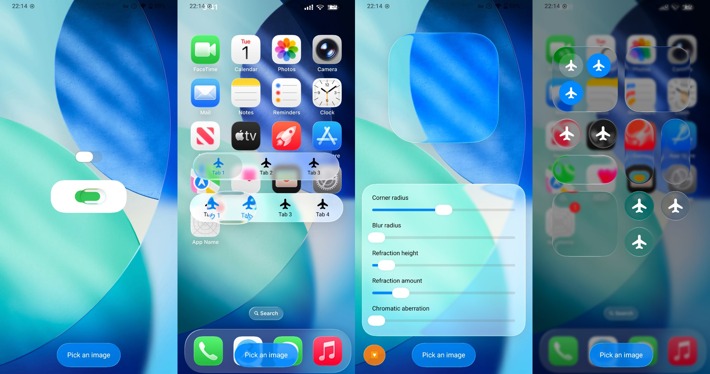

# Liquid Glass (Backdrop)

A customizable Liquid Glass effect library for Compose Multiplatform.

> Working with the classic Android View system (XML layouts) rather than Compose? See [Liquid-Glass-Android](https://github.com/QWEA0/Liquid-Glass-Android), a `FrameLayout` implementation with an API 24 floor.

## Docs

[Documentation](https://kyant.gitbook.io/backdrop)

## Components

The library does not include any high-level components; you will need to create your own.
Below are some example components:

- [LiquidButton](/app/src/commonMain/kotlin/com/kyant/backdrop/catalog/components/LiquidButton.kt)
- [LiquidToggle](/app/src/commonMain/kotlin/com/kyant/backdrop/catalog/components/LiquidToggle.kt)
- [LiquidSlider](/app/src/commonMain/kotlin/com/kyant/backdrop/catalog/components/LiquidSlider.kt)
- [LiquidBottomTabs](/app/src/commonMain/kotlin/com/kyant/backdrop/catalog/components/LiquidBottomTabs.kt)

## Demo

- [Backdrop Catalog](./androidApp/release/androidApp-release.apk)

