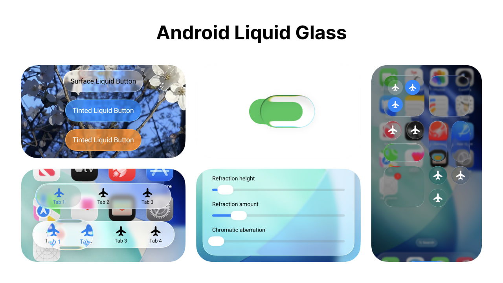

# Backdrop (Liquid Glass)

Liquid Glass effect for Android Jetpack Compose.

## Docs

⚠️ The library is in early alpha stage, every API may be changed, use it on your own risk.

[Documentation](https://kyant.gitbook.io/backdrop)

## Components

The library doesn't provide any high level components yet.

But there are some demo components in the [Catalog](./catalog/release/catalog-release.apk) app:

- [LiquidButton](/catalog/src/main/java/com/kyant/backdrop/catalog/components/LiquidButton.kt)
- [LiquidSlider](/catalog/src/main/java/com/kyant/backdrop/catalog/components/LiquidSlider.kt)
- [LiquidBottomTabs](/catalog/src/main/java/com/kyant/backdrop/catalog/components/LiquidBottomTabs.kt)

## Demos

- [Catalog](./catalog/release/catalog-release.apk)

- **(Deprecated)** [Playground app](./app/release/app-release.apk), Android 13 and above is required.

## Comparing effects with iOS

iOS device: iPhone 16 Pro Max (emulator), using [GlassExplorer](https://github.com/ktiays/GlassExplorer)

Android device: Google Pixel 4 XL (the smallest width is adjusted to 440 dp to match the density of the iOS device)

Glass size: 300 x 300, corner radius: 30

|                             iOS                              |                               Android                                |
|:------------------------------------------------------------:|:--------------------------------------------------------------------:|
|  |  |

Complete comparisons:

- [Inner refraction](https://github.com/Kyant0/AndroidLiquidGlass/blob/530bed05f8342bf607463a775dea93a531f73f42/docs/Inner%20refraction%20comparisons.md)
- [Bleed](https://github.com/Kyant0/AndroidLiquidGlass/blob/530bed05f8342bf607463a775dea93a531f73f42/docs/Bleed%20comparisons.md)

## Star history

